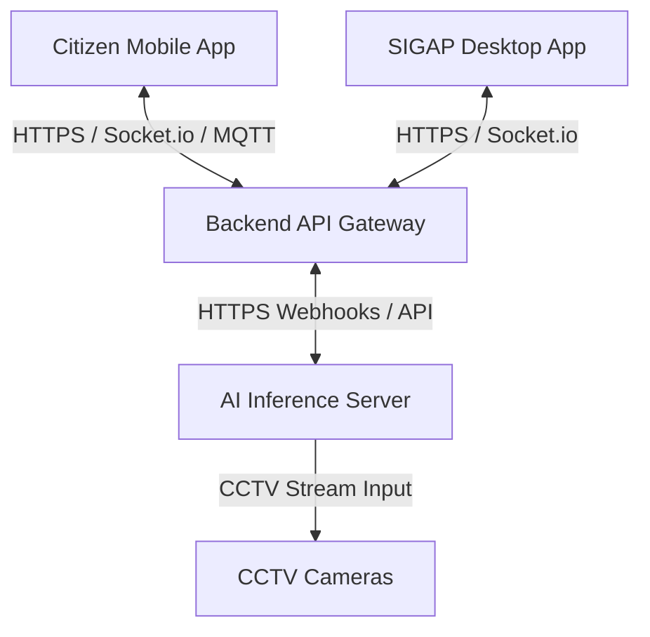
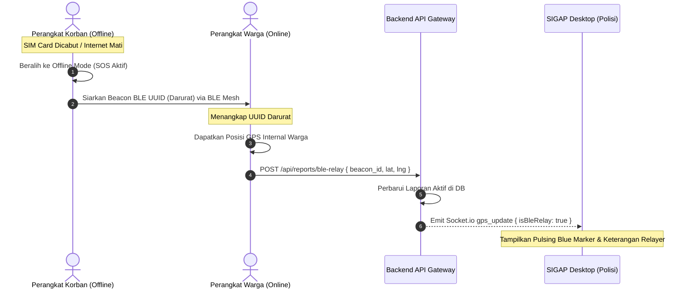
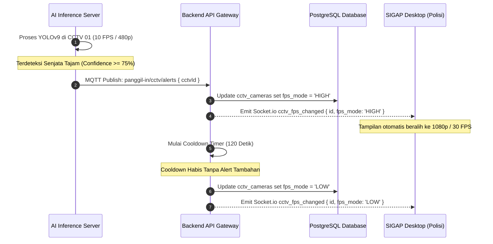
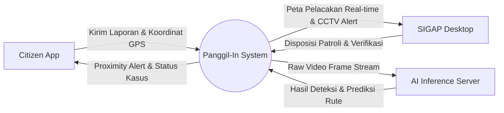
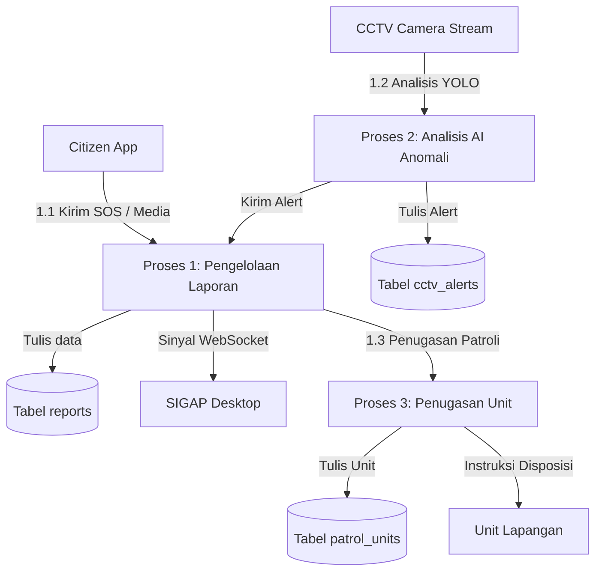

# Functional Requirement Document (FRD): Panggil-In Emergency Response System

Dokumen Persyaratan Fungsional ini merinci logika sistem, arsitektur teknis, diagram aliran data, dan integrasi komponen E2E untuk Panggil-In.

---

## 1. Pendahuluan & Cakupan Sistem

Panggil-In adalah sistem respon darurat pembegalan real-time terintegrasi yang terdiri dari empat subsistem utama:
1. **Citizen Mobile App (Flutter)**: Digunakan oleh warga untuk mengirim sinyal SOS (baik online, offline, shock detection, maupun stealth voice commands).
2. **SIGAP Desktop App (Flutter Windows)**: Dashboard pusat komando polisi untuk memantau laporan, CCTV AI alert, visualisasi rute pelarian pelaku berbasis Re-ID GNN, dan pengiriman patroli.
3. **Backend API Gateway (Express.js, TypeScript, PostgreSQL, Prisma, Socket.io, MQTT)**: Penghubung real-time, manajemen state, penyimpanan persisten, dan broker komunikasi.
4. **AI Inference Server (FastAPI, Python, YOLOv9, DeepSORT, GNN)**: Pemroses anomali rekaman CCTV secara adaptif, model Re-ID pelaku, dan prediksi graf rute pelarian begal.



---

## 2. Aktor & Use Case Diagram

### 2.1 Aktor Utama
1. **CITIZEN (Warga)**: Mengoperasikan aplikasi mobile untuk mengaktifkan SOS, merekam suara, mengirim laporan visual, mengaktifkan Fake Shutdown, dan merelay sinyal BLE mesh.
2. **POLICE_OPERATOR (Operator Polisi)**: Mengoperasikan SIGAP Desktop untuk memverifikasi laporan, menugaskan unit patroli terdekat, melihat umpan CCTV aktif, dan mengamati prediksi pelarian pelaku begal.
3. **AI_SYSTEM (Agen Kecerdasan Buatan)**: Menganalisis streams CCTV, mendeteksi senjata tajam (YOLOv9), melakukan pelacakan (DeepSORT), mengekstrak Vehicle Re-ID, memprediksi graf rute pelarian pelaku, dan menilai kecurangan anti-spoofing media.

### 2.2 Use Case Deskripsi Teknis

```mermaid
graph LR
    subgraph Aktor Utama
        Warga["CITIZEN (Warga)"]
        Polisi["POLICE_OPERATOR (Polisi)"]
        AI["AI_SYSTEM (AI)"]
    end

    subgraph Kasus Penggunaan (Use Cases)
        UC1("(Picu SOS Manual)")
        UC2("(Picu SOS Deteksi Guncangan)")
        UC3("(Picu SOS Perintah Suara)")
        UC4("(Aktifkan Fake Shutdown)")
        UC5("(Relay Sinyal BLE Mesh)")
        
        UC6("(Verifikasi Laporan SOS)")
        UC7("(Tugaskan Unit Patroli)")
        UC8("(Pantau Umpan CCTV Adaptif)")
        UC9("(Analisis Prediksi Pelarian)")
        
        UC10("(Deteksi Anomali Sajam YOLOv9)")
        UC11("(Eskalasi FPS Kamera)")
        UC12("(Prediksi Graph & Re-ID)")
    end

    Warga --> UC1
    Warga --> UC2
    Warga --> UC3
    Warga --> UC4
    Warga --> UC5

    Polisi --> UC6
    Polisi --> UC7
    Polisi --> UC8
    Polisi --> UC9

    AI --> UC10
    AI --> UC11
    AI --> UC12
```

---

## 3. Logika Alur Sistem & Sequence Diagram

### 3.1 Pemicuan SOS Darurat (Online, Offline & BLE Mesh Relay)
Ketika koneksi seluler korban mati/kartu SIM dicabut:
1. Citizen App korban memancarkan UUID darurat secara periodik via BLE Mesh.
2. Perangkat Citizen App warga sekitar mendeteksi sinyal beacon BLE tersebut.
3. Perangkat warga mengambil koordinat GPS internal mereka sendiri, lalu mengirimkannya ke backend via `POST /api/reports/ble-relay`.
4. Backend memperbarui database koordinat laporan aktif korban dan menyiarkan posisi terbaru ke SIGAP Desktop dengan visualisasi marker biru neon (Pulsing BLE Wave).



### 3.2 Deteksi CCTV Adaptif & Cooldown Reset
1. AI Inference Server menganalisis feed CCTV (mode hemat 10 FPS, 480p) menggunakan model YOLOv9.
2. Jika terdeteksi senjata tajam/agresi, AI mengirim alert ke Backend via MQTT (`panggil-in/cctv/alerts`).
3. Backend memperbarui database kamera ke mode `HIGH` (30 FPS, 1080p), memancarkan Socket.io `cctv_fps_changed` ke operator, dan menginisiasi timer cooldown 120 detik.
4. Jika dalam 120 detik tidak ada alert baru, kamera dikembalikan ke mode `LOW` dan info perubahan dipancarkan kembali.



---

## 4. Alur Data (Data Flow Diagram - DFD)

### DFD Level 0 (Context Diagram)



### DFD Level 1 (Proses Pengelolaan Laporan & Deteksi)



---

## 5. Integrasi Sistem & Spesifikasi API

### 5.1 REST API endpoints Utama

#### 1. POST `/api/reports/ble-relay` (Bypass Authentication)
* **Body Request (Zod Schema)**:
  ```json
  {
    "beacon_id": "string (uuid)",
    "latitude": "number (float)",
    "longitude": "number (float)",
    "relay_user_id": "string (uuid, optional)"
  }
  ```
* **Response (200 OK)**:
  ```json
  {
    "status": "success",
    "data": {
      "reportId": "uuid-laporan",
      "latitude": -6.90344,
      "longitude": 107.61872
    }
  }
  ```

#### 2. GET `/api/reports/heatmap` (Authenticated)
* **Response (200 OK)**:
  ```json
  {
    "status": "success",
    "data": {
      "points": [
        {
          "id": "string",
          "latitude": -6.8915,
          "longitude": 107.6161,
          "intensity": 4.5,
          "areaName": "Simpang Dago"
        }
      ]
    }
  }
  ```

#### 3. PATCH `/api/cctv/:id/fps` (Authenticated)
* **Body Request**:
  ```json
  {
    "fps_mode": "HIGH | LOW"
  }
  ```

---

## 6. Logika Penanganan Error & Toleransi Kesalahan

1. **Kegagalan Koneksi Database (Prisma Failures)**:
   * Backend mengembalikan HTTP 500 dengan pesan generic demi privasi.
   * Citizen App menyimpan log kejadian di Drift SQLite lokal dengan state `'PENDING_SYNC'` dan memicu antrean sinkronisasi ulang saat jaringan terdeteksi stabil.
2. **Brute-Force & Rate-Limiter (HTTP 429)**:
   * Percobaan masuk salah password/login > 5 kali per menit dari IP yang sama diblokir dengan kode HTTP 429.
   * Pemicuan SOS > 3 kali per menit dari pengguna yang sama otomatis dibatasi untuk menghindari spoofing banjir data ke kepolisian.
3. **Speech Command Noise Filtering**:
   * Model parsing teks suara pada BLoC menormalisasi kata (menghapus tanda baca, memotong spasi luar, dan konversi ke huruf kecil) untuk menghindari kegagalan pemicuan akibat noise aksen pembicaraan.
